# HSE.2DImageProcessing.Week3

Hello my fellow classmates 👋

Thank you for reading this introduction document! Hopefully, I would be able to keep you interested 😅

## Build

To build the project you have to have [OpenCV installed](https://docs.opencv.org/4.x/d7/d9f/tutorial_linux_install.html) on your computer. 

When everything is ready you need to navigate to `src` folder in your terminal and execute the following chain of commands.

```
mkdir build
cd build

cmake ..
make -j7
```

The build will be finished shortly after calling the command and you can expect to see the executable file inside `bin` directory. Hopefully, the file is there and you are ready to move to the next step!

## Command

Generally, the application accepts a few command line arguments. If there was a _help_ command it would output something similar to the text below.

```bash
./bin/CoinDetector image1 image_folder1 image2 ... imageN [-o output prefix] [-c metrics config] [-d debug]
```

However, it can be a bit confusing. Let me breifly explain what these arguments do. Basically, the invocation consists of two important groups: an images list and additional arguments.

1. **Images list**: just a list of either image files or folders with images. If an entry is an images folder then all images are recursively extracted from within it.

2. **Additional arguments**: all arguments are optional. If you decide to use them read thoroughly the infromation in the table below.

|Argument|Desciption|
|-----|-----|
|-d| *Debug flag*: if specified then the application displays additional processing steps, otherwise only result image with detected circles will be shown. |
|-o| *Output files prefix*: specifies the final directory for output images. If not specified then the final images will be saved in the application folder, ie the folder from where the application is located. |
|-c| *Config metrics file*: if specified then the passed images will be tested against this config and prediction metrics will be calculated. Config should contain information about coins in the given images. To create a custom config see [Config section](Config). |

### Usage example

To give you a better context on how to use the application I provided a few usage examples.

- Folder with images + metrics config

```base
./bin/CoinsDetector ../../Samples -c ../../Samples/circles.txt
```

- Single image + metrics config

```bash
./bin/CoinsDetector ../../Samples/20.jpg -c ../../Samples/circles.txt
```

- Single image + debug flag

```bash
./bin/CoinsDetector ../../Samples/20.jpg -d
```

- Single image + metrics config + custom output prefix

```bash
./bin/CoinsDetector ../../Samples/19.jpg -c ../../Samples/circles.txt -o ../../Samples
```

## Config

Config describes the given images set. When the images set is tested against config all images from the set should be on the config, however, the config may have more images descriptors than the set has. If the image is not found on the set [runtime_error](https://en.cppreference.com/w/cpp/error/runtime_error) is rised.

To make your own config or understand better how the original config is composed you may find these set of rules quite useful:

- Every image that you want to test should be described in the config;
- Every image has its own descriptor/config section;
- There should be an empty line between sections;
- A section should distinctly identify the image using image id followed by a circles list;
- *image id* is __image name__ + __image extension__, for examples, for the field `./a/b/image.png` the id is `image.png`;
- Every circle is a triple of x and y coordinates and a radius.

These rules can be visualised in the following way:

```text
image_id_1
x1,y1,r1
x2,y2,r2
x3,y3,r3

image_id_2
x1,y1,r1

...

image_id_n
x1,y1,r1
x2,y2,r2
xN,yN,rN
```

You can see how these rules are applied looking at [the given config](./Samples/circles.txt):

```text
01.jpg
185,180,66
384,285,98
609,204,111
171,369,84
343,478,58
602,504,104
169,608,81
421,638,62

02.jpg
64,66,65
185,55,43
310,62,59
56,186,54
186,184,76
313,187,53
51,306,60
142,310,39
225,309,44
320,302,50

...
```

## Test Samples

There are 20 test sample images that form the test set. All coins in the set are are distinguihsable from background, well illuminated, and do not have extreme points views.

To give you a better understanding of the tests' nature you can see the example.


You may take a look at the rest of the test set by looking at [the samples folder](./Samples/).

## Algorithm

The algorithm used in the project is not that sophisticated and can be represented as a chain of several steps.

*Note: To reproduce the same behaviour run the following command:*

```bash
./bin/CoinsDetector ../../Samples/13.jpg  -c ../../Samples/circles.txt -o ../../Images -d
```

| Step | Image  | Description  |
| ------- | --- | --- |
| 0. Original image |  | Unmodified image. This is not an actual step. I put it here to show the original image. |
| 1. Read the image |  | Converts the given image to grayscale. |
| 2. Smoothing | 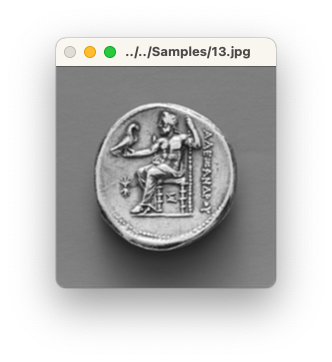 | Smooths the image using Sobel operator to reduce noise. |
| 3. Edge detection |  | Canny algorithm to detect edges. |
| 4. Thresholding | 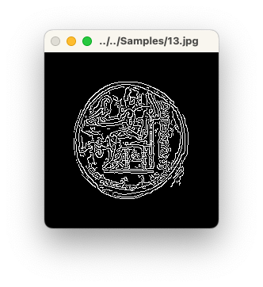 | Otsu thresholding to make a binary image. |
| 5.1 Morphological: dilate |  | Agressive dilation to combine all edges into a single circle. |
| 5.2 Morphological: open | 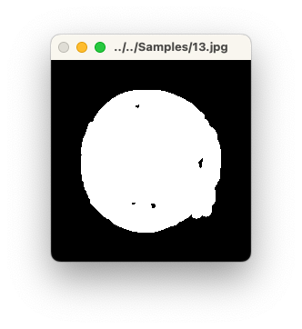 | Erosion to remove the noise and dilation to return the circles back to original sizes. |
| 6. Contour | 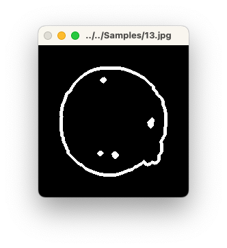 | Contours detection to separate contours of circles and draw them with a given thickness. |
| 7. Smoothing | 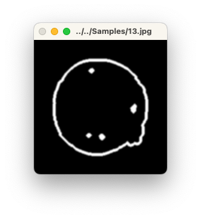 | Smoothing to reduce noise. |
| 8.1 Morphological: close | 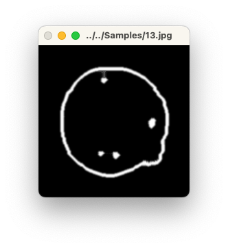 | Dilation followed by errosion to merge for the last time all separated objects. |
| 8.2 Morphological: open | 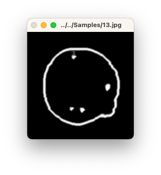 | Errosion followed by dilation to reduce noise if left. |
| 8.3 Morphological: dilate | 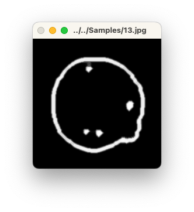 | Dilation to make contours thicker. |
| 9. Hough Circles | 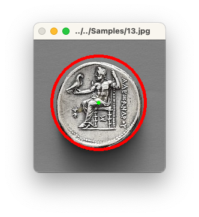 | Hough circles transform to detect circles. |


## Model Results

And the most interesting part: the results part.

*Note: To reproduce the same behaviour run the following command:*

```text
./bin/CoinsDetector ../../Samples -c ../../Samples/circles.txt
```

Overall there are __173 coins__ in the given test set. The metrics are:

|Metric|Value|
|---|---|
|True positive|154|
|True negative|0 **the value is expected as we don't have such a group in our dataset**|
|False positive|19|
|False negative|19|
|Precission|0.890173|
|Recall|0.890173|
|F1 Score|0.890173|

*As was agreed in the lecture, the model detects a few circles incorrectly and keeps the score below 100% perfect.*

You can also see a similar report in your terminal when you run the application using your own equipment.

Raw report:

```text
01.jpg                                            
File path: ../../Samples/01.jpg                              
Detected: 8     circles.
#001. Center{x=423, y=642}, Radius{68}.
#002. Center{x=600, y=501}, Radius{110}.
#003. Center{x=387, y=288}, Radius{102}.
#004. Center{x=190, y=183}, Radius{72}.
#005. Center{x=342, y=478}, Radius{63}.
#006. Center{x=171, y=612}, Radius{86}.
#007. Center{x=174, y=375}, Radius{90}.
#008. Center{x=613, y=207}, Radius{112}.

02.jpg                                            
File path: ../../Samples/02.jpg                              
Detected: 10    circles.
#001. Center{x=54, y=301}, Radius{51}.
#002. Center{x=141, y=312}, Radius{43}.
#003. Center{x=228, y=309}, Radius{47}.
#004. Center{x=318, y=192}, Radius{56}.
#005. Center{x=310, y=64}, Radius{61}.
#006. Center{x=52, y=187}, Radius{55}.
#007. Center{x=72, y=69}, Radius{68}.
#008. Center{x=186, y=57}, Radius{48}.
#009. Center{x=321, y=300}, Radius{52}.
#010. Center{x=181, y=180}, Radius{77}.

03.jpg                                            
File path: ../../Samples/03.jpg                              
Detected: 4     circles.
#001. Center{x=664, y=198}, Radius{54}.
#002. Center{x=522, y=198}, Radius{70}.
#003. Center{x=175, y=187}, Radius{60}.
#004. Center{x=342, y=198}, Radius{96}.

04.jpg                                            
File path: ../../Samples/04.jpg                              
Detected: 10    circles.
#001. Center{x=657, y=325}, Radius{89}.
#002. Center{x=312, y=573}, Radius{86}.
#003. Center{x=96, y=90}, Radius{73}.
#004. Center{x=172, y=384}, Radius{139}.
#005. Center{x=441, y=408}, Radius{111}.
#006. Center{x=592, y=118}, Radius{104}.
#007. Center{x=456, y=690}, Radius{91}.
#008. Center{x=135, y=648}, Radius{103}.
#009. Center{x=654, y=568}, Radius{120}.
#010. Center{x=331, y=148}, Radius{128}.

05.jpg                                            
File path: ../../Samples/05.jpg                              
Detected: 2     circles.
#001. Center{x=228, y=357}, Radius{172}.
#002. Center{x=474, y=348}, Radius{171}.

06.jpeg                                           
File path: ../../Samples/06.jpeg                             
Detected: 4     circles.
#001. Center{x=213, y=321}, Radius{98}.
#002. Center{x=414, y=102}, Radius{88}.
#003. Center{x=415, y=321}, Radius{95}.
#004. Center{x=216, y=105}, Radius{101}.

07.jpg                                            
File path: ../../Samples/07.jpg                              
Detected: 4     circles.
#001. Center{x=366, y=487}, Radius{95}.
#002. Center{x=648, y=498}, Radius{92}.
#003. Center{x=364, y=243}, Radius{131}.
#004. Center{x=651, y=240}, Radius{130}.

08.jpg                                            
File path: ../../Samples/08.jpg                              
Detected: 3     circles.
#001. Center{x=138, y=250}, Radius{92}.
#002. Center{x=313, y=121}, Radius{89}.
#003. Center{x=447, y=282}, Radius{93}.

09.jpg                                            
File path: ../../Samples/09.jpg                              
Detected: 3     circles.
#001. Center{x=840, y=273}, Radius{174}.
#002. Center{x=223, y=270}, Radius{178}.
#003. Center{x=529, y=285}, Radius{219}.

10.jpg                                            
File path: ../../Samples/10.jpg                              
Detected: 2     circles.
#001. Center{x=396, y=196}, Radius{115}.
#002. Center{x=405, y=546}, Radius{190}.

11.jpg                                            
File path: ../../Samples/11.jpg                              
Detected: 5     circles.
#001. Center{x=639, y=204}, Radius{109}.
#002. Center{x=153, y=162}, Radius{111}.
#003. Center{x=375, y=306}, Radius{106}.
#004. Center{x=604, y=483}, Radius{136}.
#005. Center{x=225, y=585}, Radius{185}.

12.jpg                                            
File path: ../../Samples/12.jpg                              
Detected: 1     circles.
#001. Center{x=393, y=255}, Radius{214}.

13.jpg                                            
File path: ../../Samples/13.jpg                              
Detected: 1     circles.
#001. Center{x=108, y=105}, Radius{78}.

14.jpg                                            
File path: ../../Samples/14.jpg                              
Detected: 8     circles.
#001. Center{x=378, y=229}, Radius{47}.
#002. Center{x=96, y=87}, Radius{51}.
#003. Center{x=378, y=87}, Radius{47}.
#004. Center{x=243, y=90}, Radius{55}.
#005. Center{x=514, y=231}, Radius{58}.
#006. Center{x=241, y=228}, Radius{55}.
#007. Center{x=99, y=225}, Radius{50}.
#008. Center{x=514, y=90}, Radius{59}.

15.jpg                                            
File path: ../../Samples/15.jpg                              
Detected: 6     circles.
#001. Center{x=309, y=282}, Radius{55}.
#002. Center{x=108, y=111}, Radius{56}.
#003. Center{x=105, y=279}, Radius{55}.
#004. Center{x=303, y=114}, Radius{56}.
#005. Center{x=525, y=114}, Radius{56}.
#006. Center{x=511, y=274}, Radius{68}.

16.jpeg                                           
File path: ../../Samples/16.jpeg                             
Detected: 4     circles.
#001. Center{x=780, y=157}, Radius{77}.
#002. Center{x=309, y=279}, Radius{65}.
#003. Center{x=534, y=117}, Radius{76}.
#004. Center{x=627, y=363}, Radius{74}.

17.jpg                                            
File path: ../../Samples/17.jpg                              
Detected: 4     circles.
#001. Center{x=267, y=598}, Radius{148}.
#002. Center{x=549, y=595}, Radius{148}.
#003. Center{x=225, y=246}, Radius{180}.
#004. Center{x=571, y=243}, Radius{180}.

18.jpg                                            
File path: ../../Samples/18.jpg                              
Detected: 9     circles.
#001. Center{x=894, y=342}, Radius{77}.
#002. Center{x=457, y=951}, Radius{70}.
#003. Center{x=918, y=1221}, Radius{89}.
#004. Center{x=432, y=363}, Radius{77}.
#005. Center{x=441, y=636}, Radius{99}.
#006. Center{x=933, y=948}, Radius{84}.
#007. Center{x=540, y=733}, Radius{233}.
#008. Center{x=429, y=1245}, Radius{93}.
#009. Center{x=612, y=507}, Radius{309}.

19.jpg                                            
File path: ../../Samples/19.jpg                              
Detected: 2     circles.
#001. Center{x=145, y=214}, Radius{136}.
#002. Center{x=456, y=210}, Radius{137}.

20.jpg                                            
File path: ../../Samples/20.jpg                              
Detected: 9     circles.
#001. Center{x=858, y=516}, Radius{145}.
#002. Center{x=174, y=502}, Radius{149}.
#003. Center{x=516, y=852}, Radius{146}.
#004. Center{x=849, y=181}, Radius{154}.
#005. Center{x=510, y=516}, Radius{163}.
#006. Center{x=843, y=843}, Radius{164}.
#007. Center{x=186, y=183}, Radius{151}.
#008. Center{x=504, y=180}, Radius{155}.
#009. Center{x=177, y=840}, Radius{160}.

21.jpg                                            
File path: ../../Samples/21.jpg                              
Detected: 1     circles.
#001. Center{x=489, y=264}, Radius{240}.

22.jpg                                            
File path: ../../Samples/22.jpg                              
Detected: 3     circles.
#001. Center{x=420, y=157}, Radius{69}.
#002. Center{x=315, y=318}, Radius{91}.
#003. Center{x=198, y=126}, Radius{105}.

23.jpg                                            
File path: ../../Samples/23.jpg                              
Detected: 16    circles.
#001. Center{x=238, y=102}, Radius{63}.
#002. Center{x=615, y=90}, Radius{72}.
#003. Center{x=633, y=253}, Radius{83}.
#004. Center{x=642, y=445}, Radius{93}.
#005. Center{x=327, y=102}, Radius{64}.
#006. Center{x=150, y=657}, Radius{113}.
#007. Center{x=208, y=265}, Radius{74}.
#008. Center{x=324, y=267}, Radius{73}.
#009. Center{x=189, y=442}, Radius{94}.
#010. Center{x=517, y=450}, Radius{90}.
#011. Center{x=498, y=93}, Radius{71}.
#012. Center{x=678, y=654}, Radius{101}.
#013. Center{x=511, y=252}, Radius{86}.
#014. Center{x=292, y=657}, Radius{111}.
#015. Center{x=303, y=447}, Radius{92}.
#016. Center{x=529, y=660}, Radius{103}.

24.png                                            
File path: ../../Samples/24.png                              
Detected: 20    circles.
#001. Center{x=153, y=300}, Radius{39}.
#002. Center{x=255, y=124}, Radius{40}.
#003. Center{x=453, y=300}, Radius{39}.
#004. Center{x=48, y=219}, Radius{42}.
#005. Center{x=249, y=300}, Radius{41}.
#006. Center{x=444, y=45}, Radius{41}.
#007. Center{x=150, y=42}, Radius{41}.
#008. Center{x=249, y=42}, Radius{41}.
#009. Center{x=54, y=300}, Radius{39}.
#010. Center{x=151, y=123}, Radius{43}.
#011. Center{x=348, y=42}, Radius{41}.
#012. Center{x=445, y=126}, Radius{41}.
#013. Center{x=150, y=219}, Radius{41}.
#014. Center{x=349, y=300}, Radius{41}.
#015. Center{x=349, y=124}, Radius{41}.
#016. Center{x=252, y=216}, Radius{41}.
#017. Center{x=51, y=42}, Radius{41}.
#018. Center{x=447, y=219}, Radius{41}.
#019. Center{x=349, y=219}, Radius{41}.
#020. Center{x=49, y=132}, Radius{41}.

25.jpg                                            
File path: ../../Samples/25.jpg                              
Detected: 5     circles.
#001. Center{x=387, y=255}, Radius{62}.
#002. Center{x=300, y=93}, Radius{88}.
#003. Center{x=267, y=249}, Radius{61}.
#004. Center{x=453, y=136}, Radius{75}.
#005. Center{x=114, y=159}, Radius{101}.

26.jpg                                            
File path: ../../Samples/26.jpg                              
Detected: 6     circles.
#001. Center{x=169, y=196}, Radius{31}.
#002. Center{x=270, y=195}, Radius{35}.
#003. Center{x=267, y=99}, Radius{35}.
#004. Center{x=363, y=195}, Radius{33}.
#005. Center{x=459, y=99}, Radius{34}.
#006. Center{x=462, y=195}, Radius{35}.

27.jpg                                            
File path: ../../Samples/27.jpg                              
Detected: 6     circles.
#001. Center{x=1195, y=33}, Radius{163}.
#002. Center{x=1035, y=612}, Radius{159}.
#003. Center{x=168, y=540}, Radius{169}.
#004. Center{x=1353, y=403}, Radius{184}.
#005. Center{x=238, y=126}, Radius{163}.
#006. Center{x=577, y=528}, Radius{147}.

28.jpg                                            
File path: ../../Samples/28.jpg                              
Detected: 10    circles.
#001. Center{x=1344, y=192}, Radius{45}.
#002. Center{x=1116, y=444}, Radius{33}.
#003. Center{x=1437, y=153}, Radius{33}.
#004. Center{x=1065, y=534}, Radius{36}.
#005. Center{x=1612, y=591}, Radius{34}.
#006. Center{x=307, y=123}, Radius{36}.
#007. Center{x=1723, y=276}, Radius{35}.
#008. Center{x=201, y=396}, Radius{67}.
#009. Center{x=423, y=366}, Radius{313}.
#010. Center{x=1500, y=390}, Radius{260}.

29.jpg                                            
File path: ../../Samples/29.jpg                              
Detected: 6     circles.
#001. Center{x=525, y=277}, Radius{120}.
#002. Center{x=523, y=502}, Radius{122}.
#003. Center{x=522, y=720}, Radius{121}.
#004. Center{x=972, y=720}, Radius{124}.
#005. Center{x=753, y=285}, Radius{118}.
#006. Center{x=976, y=277}, Radius{117}.

30.jpg                                            
File path: ../../Samples/30.jpg                              
Detected: 1     circles.
#001. Center{x=541, y=366}, Radius{243}.

P.S.: Calculating metrics may take a while.

The test set has 173 coins.

Confusion matrix values:
true positive       154                 
true negative       0                   
false positive      19                  
false negative      19                  

Prediction metrics:
precision           0.890173            
recall              0.890173            
f1                  0.890173 
```

### Detected circles example

This section just shows a few final result.

| Sample 4 | Sample 9 | Sample 14 |
| --- | --- | --- |
| 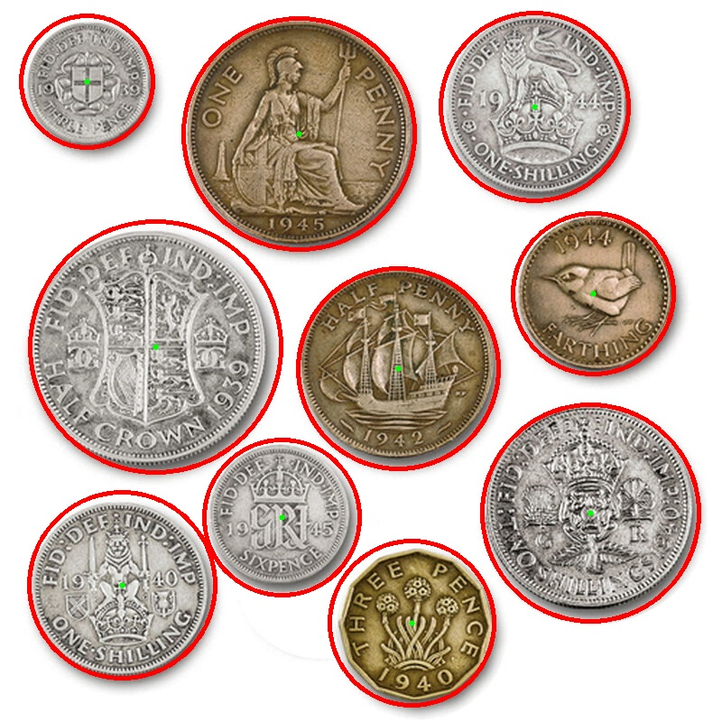 | 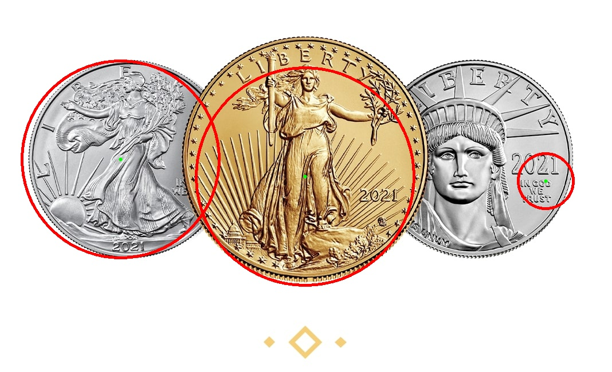| 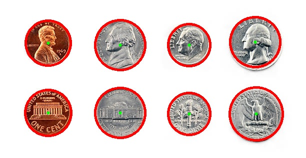 |

Also I attached the results of the coins from lectures

| Sample 1 | Sample 2 |
| --- | --- |
| 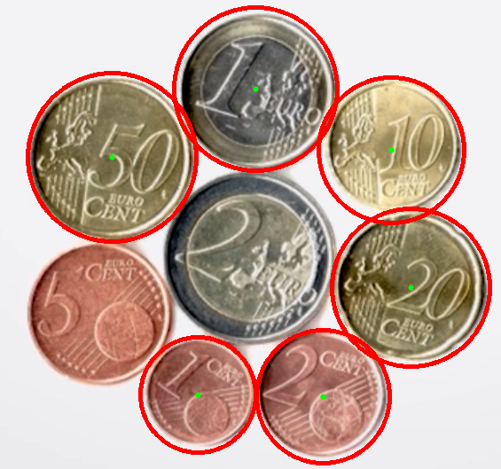 | 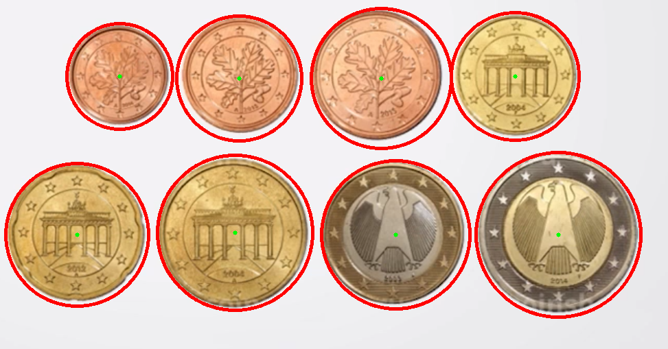|

**Additional test images can be found in [Additional](./Additional/).**

### Images where the model fails

My model fails to detect coins that are located on a noisy background (non-monochromatic) or with coins captured using extreme angles.

Such examples are given below:

| Sample 2 | Sample 4 |
| --- | --- |
| 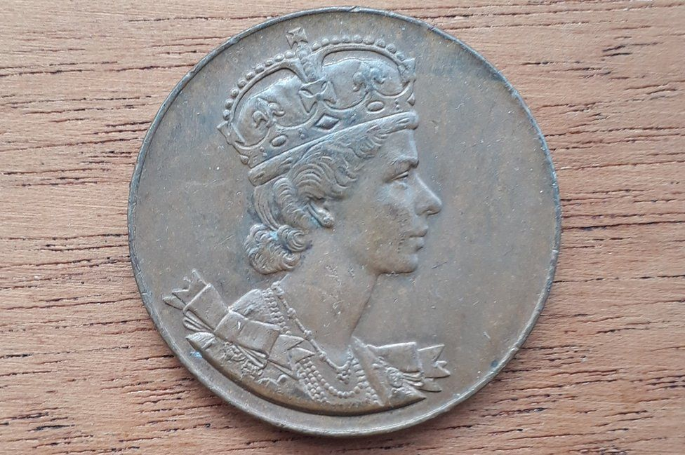| 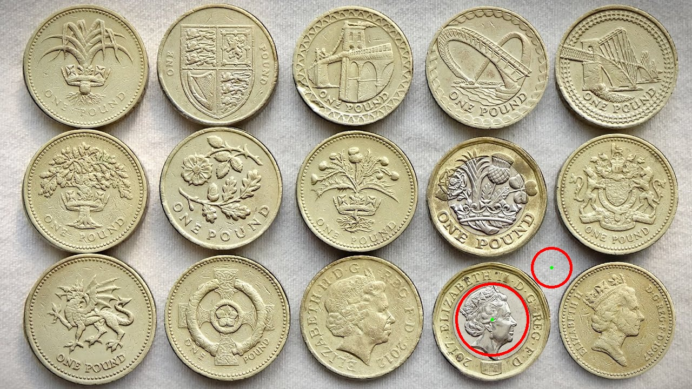 |


Wow, if you read this far you're a real hero. 
*Hopefully, you've enjoyed the reading the document. Thank you and good luck!*

## License

```text
MIT License

Copyright (c) 2022 Alex Dadukin

Permission is hereby granted, free of charge, to any person obtaining a copy
of this software and associated documentation files (the "Software"), to deal
in the Software without restriction, including without limitation the rights
to use, copy, modify, merge, publish, distribute, sublicense, and/or sell
copies of the Software, and to permit persons to whom the Software is
furnished to do so, subject to the following conditions:

The above copyright notice and this permission notice shall be included in all
copies or substantial portions of the Software.

THE SOFTWARE IS PROVIDED "AS IS", WITHOUT WARRANTY OF ANY KIND, EXPRESS OR
IMPLIED, INCLUDING BUT NOT LIMITED TO THE WARRANTIES OF MERCHANTABILITY,
FITNESS FOR A PARTICULAR PURPOSE AND NONINFRINGEMENT. IN NO EVENT SHALL THE
AUTHORS OR COPYRIGHT HOLDERS BE LIABLE FOR ANY CLAIM, DAMAGES OR OTHER
LIABILITY, WHETHER IN AN ACTION OF CONTRACT, TORT OR OTHERWISE, ARISING FROM,
OUT OF OR IN CONNECTION WITH THE SOFTWARE OR THE USE OR OTHER DEALINGS IN THE
SOFTWARE.

```
