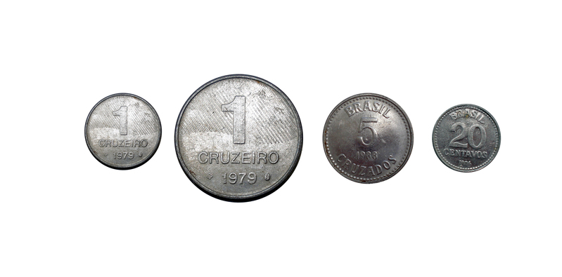
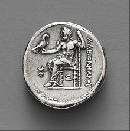
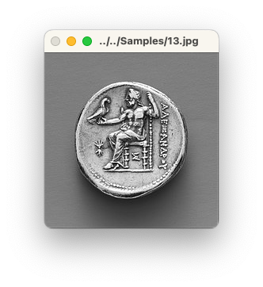
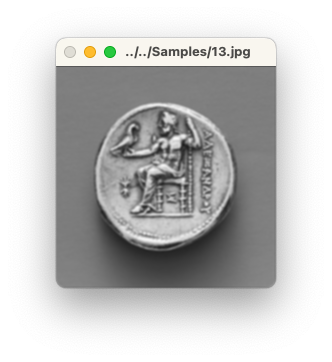
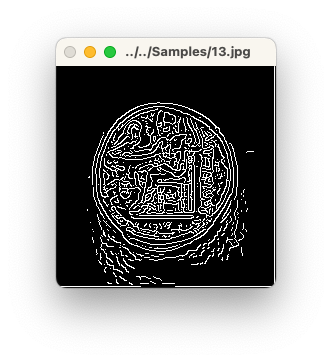
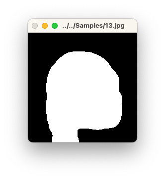
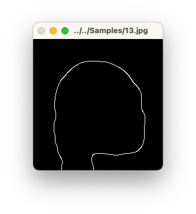
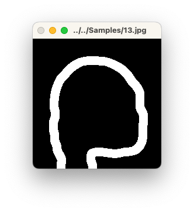
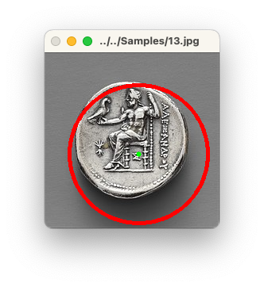

# HSE.2DImageProcessing.Week3

Hello my fellow classmates 👋

## Build

You have to have [OpenCV installed](https://docs.opencv.org/4.x/d7/d9f/tutorial_linux_install.html) on your computer.

From `src` folder:

```
mkdir build
cd build

cmake ..
make -j7
```

_P.S.: The executable file will be inside `bin` directory._

## Command

To run the command one may find this information about command line arguments handful.
The command looks like the code below:

```bash
./bin/CoinDetector image1 image_folder1 image2 ... imageN [-o output prefix] [-c metrics config] [-d debug]
```

Basically, the command consists of two parts: images list and additional arguments:

1. Command accepts list of images. An entry of the list may be either an image file or a folder with images. If the entry is an images folder then all images will be recursively extracted from within it.

2. Arguments are optional. The arguments are described in the table below.

|Argument|Desciption|
|-----|-----|
|-d| Debug flag: if specified then the application displays additional processing steps, otherwise only result image with detected circles will be shown. |
|-o| Output files prefix: specifies the final directory for output images. If not specified then the final images will be saved in the application folder. |
|-c| Config metrics file. If specified then the passed images will be tested against this config and prediction metrics will be calculated. Config should contain information about coins in the given images. To create a custom config see [Config section](Config). |

### Usage example

A few examples of the command.

- Folder with images + metrics config

```base
./bin/CoinsDetector ../../Samples -c ../../Samples/circles.txt
```

- Single image + metrics config

```bash
./bin/CoinsDetector ../../Samples/20.jpg -c ../../Samples/circles.txt
```

- Single image + debug flag

```bash
./bin/CoinsDetector ../../Samples/20.jpg -d
```

- Single image + metrics config + custom output prefix

```bash
./bin/CoinsDetector ../../Samples/19.jpg -c ../../Samples/circles.txt -o ../../Samples
```

## Config

Config describes the given images set.
The metrics config can be composed using a few simple rules:
- Every images that you want to test should be described in the config
- All images are described separately
- Between images section should be an empty line
- Image section should distinctly identify the image by image id and followed circles
- Image id is __image name__ + __image extension__
- Circle should be described as a triple of x and y coordinates and radius

These rules can be visualised in the following way:

```text
image_id_1
x1,y1,r1
x2,y2,r2
x3,y3,r3

image_id_2
x1,y1,r1

...

image_id_n
x1,y1,r1
x2,y2,r2
xN,yN,rN
```

The example of the config is:

```text
01.jpg
185,180,66
384,285,98
609,204,111
171,369,84
343,478,58
602,504,104
169,608,81
421,638,62

02.jpg
64,66,65
185,55,43
310,62,59
56,186,54
186,184,76
313,187,53
51,306,60
142,310,39
225,309,44
320,302,50

...
```

Config for algorithm can be found in [Samples folder](./Samples/circles.txt).

### Test Samples

Test samples contain 20 images of coins: the coins are distinguihsable from background.
You may find all of them in [the samples folder](./Samples/).



### Algorithm

Algorithm consists of several steps.

To see the same steps run the following command:

```bash
./bin/CoinsDetector ../../Samples/13.jpg  -c ../../Samples/circles.txt -o ../../Images -d
```

| Step | Image  | Description  |
| ------- | --- | --- |
| 0. Original image |  | Unmodified image |
| 1. Read |  | Convert the given image to grayscale |
| 2. Smoothing |  | Smooths the image a bit using Sobel operator to reduce noise |
| 3.1. Edge extraction | | Canny algorithm to detect edges |
| 3.2. Thresholding |  | Otsu thresholding to make binary image |
| 4. Morphological: close |  | Dilation to combine all edges into a single circle + erosion to return the circles back to original sizes |
| 5. Morphological: open |  | Erosion to remove the noise and dilation to return the circles back to original sizes |
| 6. Edge detection |  | Canny edge detection again to leave edges only |
| 7. Morphological: dilate |  | Dilation to thicker the edges |
| 8. Hough Circles |  | Hough circles transform to detect circles |


### Model Results

The command to validate the results is

```text
./bin/CoinsDetector ../../Samples -c ../../Samples/circles.txt
```

Overall there are __101 coins__ in the given dataset.

Metrics for the given test set are

|Metric|Value|
|---|---|
|True positive|93|
|True negative|0 **it is expected as we don't have such group**|
|False positive|3|
|False negative|8|
|Precission|0.96875|
|Recall|0.920792|
|F1 Score|0.944162|

Raw report:

```text
01.jpg                                            
File path: ../../Samples/01.jpg                              
Detected: 8     circles.
#001. Center{x=340, y=474}, Radius{54}.
#002. Center{x=596, y=494}, Radius{102}.
#003. Center{x=186, y=180}, Radius{66}.
#004. Center{x=170, y=612}, Radius{81}.
#005. Center{x=392, y=292}, Radius{91}.
#006. Center{x=424, y=636}, Radius{63}.
#007. Center{x=170, y=366}, Radius{83}.
#008. Center{x=614, y=194}, Radius{100}.

02.jpg                                            
File path: ../../Samples/02.jpg                              
Detected: 9     circles.
#001. Center{x=140, y=312}, Radius{33}.
#002. Center{x=50, y=302}, Radius{41}.
#003. Center{x=312, y=188}, Radius{47}.
#004. Center{x=62, y=62}, Radius{58}.
#005. Center{x=310, y=62}, Radius{57}.
#006. Center{x=184, y=54}, Radius{44}.
#007. Center{x=228, y=308}, Radius{37}.
#008. Center{x=60, y=186}, Radius{47}.
#009. Center{x=180, y=182}, Radius{66}.

03.jpg                                            
File path: ../../Samples/03.jpg                              
Detected: 4     circles.
#001. Center{x=664, y=198}, Radius{49}.
#002. Center{x=174, y=190}, Radius{55}.
#003. Center{x=522, y=198}, Radius{65}.
#004. Center{x=338, y=196}, Radius{92}.

04.jpg                                            
File path: ../../Samples/04.jpg                              
Detected: 10    circles.
#001. Center{x=318, y=570}, Radius{85}.
#002. Center{x=102, y=98}, Radius{71}.
#003. Center{x=142, y=654}, Radius{106}.
#004. Center{x=656, y=330}, Radius{89}.
#005. Center{x=598, y=130}, Radius{107}.
#006. Center{x=450, y=404}, Radius{114}.
#007. Center{x=454, y=698}, Radius{87}.
#008. Center{x=162, y=376}, Radius{139}.
#009. Center{x=656, y=568}, Radius{119}.
#010. Center{x=326, y=152}, Radius{132}.

05.jpg                                            
File path: ../../Samples/05.jpg                              
Detected: 1     circles.
#001. Center{x=484, y=356}, Radius{181}.

06.jpeg                                           
File path: ../../Samples/06.jpeg                             
Detected: 5     circles.
#001. Center{x=406, y=104}, Radius{96}.
#002. Center{x=314, y=224}, Radius{47}.
#003. Center{x=226, y=330}, Radius{94}.
#004. Center{x=418, y=322}, Radius{86}.
#005. Center{x=218, y=102}, Radius{98}.

07.jpg                                            
File path: ../../Samples/07.jpg                              
Detected: 3     circles.
#001. Center{x=360, y=498}, Radius{89}.
#002. Center{x=638, y=508}, Radius{91}.
#003. Center{x=636, y=238}, Radius{127}.

08.jpg                                            
File path: ../../Samples/08.jpg                              
Detected: 3     circles.
#001. Center{x=144, y=270}, Radius{100}.
#002. Center{x=456, y=274}, Radius{90}.
#003. Center{x=332, y=146}, Radius{98}.

09.jpg                                            
File path: ../../Samples/09.jpg                              
Detected: 3     circles.
#001. Center{x=952, y=316}, Radius{48}.
#002. Center{x=210, y=278}, Radius{172}.
#003. Center{x=532, y=308}, Radius{190}.

10.jpg                                            
File path: ../../Samples/10.jpg                              
Detected: 2     circles.
#001. Center{x=402, y=204}, Radius{116}.
#002. Center{x=410, y=540}, Radius{189}.

11.jpg                                            
File path: ../../Samples/11.jpg                              
Detected: 5     circles.
#001. Center{x=140, y=170}, Radius{110}.
#002. Center{x=652, y=206}, Radius{110}.
#003. Center{x=604, y=488}, Radius{138}.
#004. Center{x=368, y=304}, Radius{111}.
#005. Center{x=230, y=586}, Radius{180}.

12.jpg                                            
File path: ../../Samples/12.jpg                              
Detected: 1     circles.
#001. Center{x=384, y=278}, Radius{213}.

13.jpg                                            
File path: ../../Samples/13.jpg                              
Detected: 1     circles.
#001. Center{x=118, y=128}, Radius{87}.

14.jpg                                            
File path: ../../Samples/14.jpg                              
Detected: 8     circles.
#001. Center{x=510, y=84}, Radius{50}.
#002. Center{x=378, y=90}, Radius{42}.
#003. Center{x=96, y=86}, Radius{45}.
#004. Center{x=378, y=228}, Radius{42}.
#005. Center{x=240, y=226}, Radius{50}.
#006. Center{x=96, y=226}, Radius{46}.
#007. Center{x=240, y=90}, Radius{50}.
#008. Center{x=512, y=228}, Radius{53}.

15.jpg                                            
File path: ../../Samples/15.jpg                              
Detected: 6     circles.
#001. Center{x=106, y=108}, Radius{51}.
#002. Center{x=300, y=114}, Radius{51}.
#003. Center{x=104, y=278}, Radius{50}.
#004. Center{x=522, y=114}, Radius{51}.
#005. Center{x=308, y=278}, Radius{50}.
#006. Center{x=512, y=270}, Radius{63}.

16.jpeg                                           
File path: ../../Samples/16.jpeg                             
Detected: 4     circles.
#001. Center{x=532, y=128}, Radius{70}.
#002. Center{x=618, y=358}, Radius{64}.
#003. Center{x=306, y=276}, Radius{60}.
#004. Center{x=770, y=142}, Radius{74}.

17.jpg                                            
File path: ../../Samples/17.jpg                              
Detected: 5     circles.
#001. Center{x=492, y=490}, Radius{38}.
#002. Center{x=270, y=598}, Radius{144}.
#003. Center{x=560, y=600}, Radius{141}.
#004. Center{x=244, y=236}, Radius{177}.
#005. Center{x=562, y=246}, Radius{182}.

18.jpg                                            
File path: ../../Samples/18.jpg                              
Detected: 7     circles.
#001. Center{x=458, y=954}, Radius{68}.
#002. Center{x=432, y=1254}, Radius{90}.
#003. Center{x=908, y=646}, Radius{94}.
#004. Center{x=908, y=330}, Radius{83}.
#005. Center{x=432, y=364}, Radius{76}.
#006. Center{x=440, y=632}, Radius{92}.
#007. Center{x=904, y=1216}, Radius{113}.

19.jpg                                            
File path: ../../Samples/19.jpg                              
Detected: 2     circles.
#001. Center{x=150, y=216}, Radius{125}.
#002. Center{x=446, y=208}, Radius{137}.

20.jpg                                            
File path: ../../Samples/20.jpg                              
Detected: 9     circles.
#001. Center{x=514, y=516}, Radius{158}.
#002. Center{x=170, y=506}, Radius{145}.
#003. Center{x=840, y=506}, Radius{145}.
#004. Center{x=182, y=846}, Radius{159}.
#005. Center{x=506, y=848}, Radius{149}.
#006. Center{x=506, y=176}, Radius{156}.
#007. Center{x=178, y=188}, Radius{156}.
#008. Center{x=840, y=838}, Radius{165}.
#009. Center{x=852, y=180}, Radius{153}.

P.S.: Calculating metrics may take a while.

The test set has 101 coins.

Confusion matrix values:
true positive       93                  
true negative       0                   
false positive      3                   
false negative      8                   

Prediction metrics:
precision           0.96875             
recall              0.920792            
f1                  0.944162
```

### License

```text
MIT License

Copyright (c) 2022 Alex Dadukin

Permission is hereby granted, free of charge, to any person obtaining a copy
of this software and associated documentation files (the "Software"), to deal
in the Software without restriction, including without limitation the rights
to use, copy, modify, merge, publish, distribute, sublicense, and/or sell
copies of the Software, and to permit persons to whom the Software is
furnished to do so, subject to the following conditions:

The above copyright notice and this permission notice shall be included in all
copies or substantial portions of the Software.

THE SOFTWARE IS PROVIDED "AS IS", WITHOUT WARRANTY OF ANY KIND, EXPRESS OR
IMPLIED, INCLUDING BUT NOT LIMITED TO THE WARRANTIES OF MERCHANTABILITY,
FITNESS FOR A PARTICULAR PURPOSE AND NONINFRINGEMENT. IN NO EVENT SHALL THE
AUTHORS OR COPYRIGHT HOLDERS BE LIABLE FOR ANY CLAIM, DAMAGES OR OTHER
LIABILITY, WHETHER IN AN ACTION OF CONTRACT, TORT OR OTHERWISE, ARISING FROM,
OUT OF OR IN CONNECTION WITH THE SOFTWARE OR THE USE OR OTHER DEALINGS IN THE
SOFTWARE.

```
